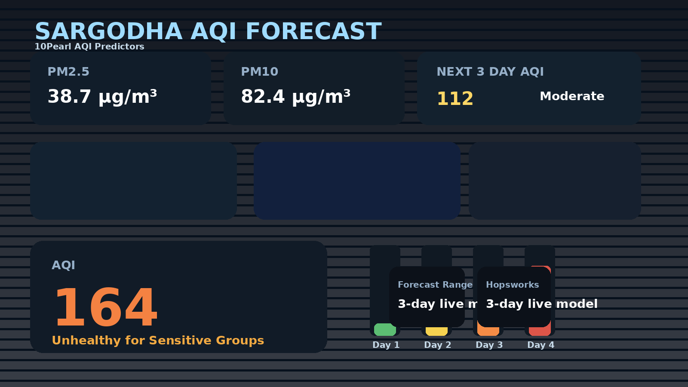
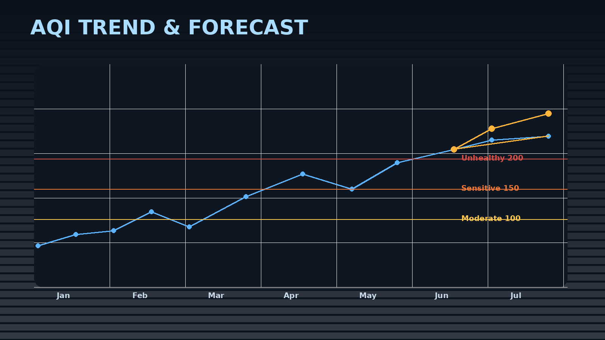

# Sargodha AQI Prediction Model

A 3-day air quality forecasting system for Sargodha, Punjab, Pakistan. This project combines live weather and AQI data from Open-Meteo with a Hopsworks-hosted machine learning pipeline to forecast air quality for the next three days in a clean, interactive Streamlit dashboard.

## Overview

The app fetches historical and live environmental data, builds engineered features, loads pre-trained Gradient Boosting models for Day 1, Day 2, and Day 3, and presents a user-friendly AQI forecast with alert levels and trend visualization.

It is designed for:

- real-time AQI monitoring
- short-term pollution forecasting
- air quality awareness for sensitive groups
- deployment on Streamlit Community Cloud
- model training and registry management through Hopsworks

## Live Demo

The dashboard is built to run on Streamlit and supports deployment to Streamlit Community Cloud.





## Features

- 3-day forecast for AQI using separate models for Day 1, Day 2, and Day 3
- Live weather and air quality metrics from Open-Meteo
- AQI category classification with color-coded health advisory
- Forecast alert banners for moderate and severe pollution conditions
- Historical AQI trend + model forecast visualization
- Hopsworks model registry integration for production-ready deployment
- Support for local `.env` configuration and Streamlit Cloud secrets

## System Architecture

```text
Open-Meteo Archive API
        |
        v
Daily data aggregation + feature engineering
        |
        v
Three GradientBoostingRegressor models
        |
        +--> retrain_artifacts/
        |
        +--> Hopsworks Model Registry
                    |
                    v
            Streamlit app (app.py)
                    |
                    v
      Live AQI forecast + health warnings + dashboard charts
```

## Repository Structure

```text
.
├── app.py                          # Streamlit dashboard application
├── retrain.py                     # Training, feature engineering, and model upload pipeline
├── requirements.txt               # App dependencies
├── requirements-retrain.txt       # Retraining dependencies
├── README.md                      # Project documentation
├── new.ipynb                      # Notebook used during experiments
├── .github/
│   └── workflows/
│       └── retrain.yml           # Scheduled retraining workflow
├── docs/
│   ├── dashboard-preview.png      # Dashboard preview screenshot
│   └── trend-forecast.png        # Forecast chart screenshot
├── .gitignore                     # Ignored project files
└── .env                           # Local environment secrets (not committed)
```

## Tech Stack

- Python 3.11+
- Streamlit
- Pandas, NumPy
- scikit-learn
- XGBoost
- Plotly
- Hopsworks
- Open-Meteo APIs
- Joblib

## Requirements

Before running the app, install the dependencies:

```bash
python -m pip install --upgrade pip
python -m pip install -r requirements.txt
```

For retraining or model registry updates:

```bash
python -m pip install -r requirements-retrain.txt
```

## Hopsworks Setup

This project expects a valid Hopsworks API key.

### Option 1: Environment variable

```bash
export HOPSWORKS_API_KEY="your_key_here"
```

### Option 2: Local .env file

Create a `.env` file in the project root:

```dotenv
HOPSWORKS_API_KEY=your_key_here
```

### Option 3: Streamlit Community Cloud secrets

In Streamlit Cloud, add this secret under Settings → Secrets:

```toml
HOPSWORKS_API_KEY = "your_key_here"
```

The app automatically checks for the key in:

- environment variables
- `.env`
- `st.secrets`
- sidebar input

## Run Locally

```bash
streamlit run app.py
```

Open the app in your browser at:

```text
http://localhost:8501
```

## Model Training and Registry Flow

The training pipeline does the following:

1. Loads historical weather and AQI data from Open-Meteo
2. Aggregates hourly data into daily observations
3. Builds lag, rolling-window, calendar, and future-weather features
4. Trains three separate models for Day 1, Day 2, and Day 3
5. Compares the new model metrics with previously registered versions
6. Uploads the model only when it improves the registry version

Model names used in the project:

```text
sargodha_aqi_gbr_day1
sargodha_aqi_gbr_day2
sargodha_aqi_gbr_day3
```

## Forecast Logic

The app calculates AQI using model inputs such as:

- lagged AQI values
- PM2.5 lag values
- temperature lag values
- rolling AQI statistics
- day-of-year seasonal features
- future weather variables for the next forecast horizon

This helps capture both short-term pollution patterns and seasonal changes in air quality.

## SHAP Explainability

To make the AQI forecasts more transparent, the project uses SHAP (SHapley Additive exPlanations) to explain the model output for each forecast horizon. The analysis workflow in `new.ipynb` computes SHAP values on the validation set and produces summary plots that highlight which inputs contribute most to a predicted AQI increase or decrease.

The most influential features are usually:

- lagged AQI and PM2.5 values from recent days
- rolling AQI statistics and short-term pollution trends
- temperature, humidity, and wind-related conditions
- seasonal or cyclical features such as day-of-year effects

This gives stakeholders a clearer view of why the model predicts elevated pollution on a particular day and helps communicate risk in a more interpretable way alongside the forecast dashboard.

## Deployment on Streamlit Community Cloud

To deploy this project on Streamlit Cloud:

1. Push this repository to GitHub
2. Open Streamlit Community Cloud
3. Create a new app from the repo
4. Set the branch to `main`
5. Add the `HOPSWORKS_API_KEY` secret
6. Restart or redeploy the app

## GitHub Actions Retraining

The project includes a workflow in `.github/workflows/retrain.yml` for automated retraining.

Required repository secrets:

```text
HOPSWORKS_API_KEY
GMAIL_USERNAME
GMAIL_APP_PASSWORD
```

This workflow installs the retraining dependencies and runs:

```bash
python retrain.py
```

## Data Sources

- Historical weather: Open-Meteo Archive API
- Historical AQI and pollutant concentrations: Open-Meteo Air Quality API
- Live weather and forecast weather: Open-Meteo Forecast API

Sargodha coordinates used by the app:

```text
Latitude: 32.0836
Longitude: 72.6711
```

## Troubleshooting

### Hopsworks key not accepted

Check that the key is correctly stored in one of the supported locations:

- environment variable
- `.env`
- Streamlit Cloud secrets
- sidebar field

### Models do not load

Make sure:

- the API key is valid
- the Hopsworks project is correct
- the model versions exist in the registry
- the model artifact includes `features.pkl` and a valid model object

### Open-Meteo requests fail

Verify internet access and confirm the API is responding properly. Some fallback values are used for the live cards, but forecast execution will fail if the required historical or model data is unavailable.

## Validation Commands

```bash
python -m py_compile app.py retrain.py
python -m pip check
python -c "import hopsworks, joblib, numpy, pandas, requests, sklearn; print('Dependencies loaded successfully')"
```

## Security Notes

- Do not commit `.env` files or secret credentials
- Do not upload API keys to GitHub in plain text
- Use GitHub secrets or Streamlit secrets for deployment
- Rotate exposed keys immediately if they are accidentally shared

## License

This project is intended for educational and research use. Please use it responsibly and ensure that any external API or cloud credentials remain secure.

## Project Status

This repository is actively used for AQI forecasting, Hopsworks model registry integration, and Streamlit-based visualization.

## Contact

For questions or collaboration inquiries, please reach out through the repository issues or the project maintainer profile on GitHub.
